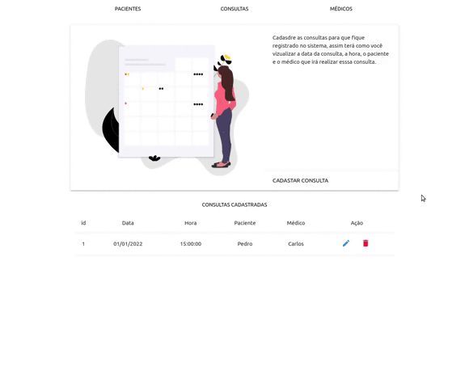

<h1 align='center'>Consultório Médico</h1>

<div>
    <p align='center'>
    
    <p>
<div>

---

## 📖 Sobre

O presente projeto foi desenvolvido com o objetivo de construir os processos de um **Consultório Médico**

Assim, nesse projeto é possível ler, alterar, criar e deletar **(CRUD)**, das três áreas do sistema: Pacientes, Médicos e Consultas.

---

## ⬇️ Como baixar o projeto

```bash

    #Clonar o Repositório (Via Terminal)
    $ git clone https://github.com/xpedroleonardo/Consultorio-php.git

    #Ou

    #Botão verde acima (Zip)
    Baixar projeto compactado

```

---
